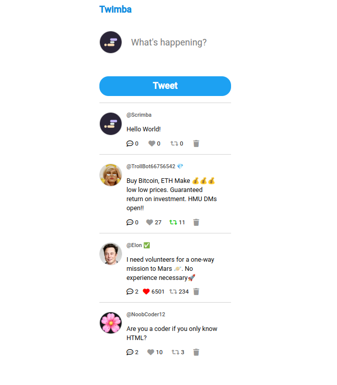

# Twitter Clone Project

This project is a Twitter clone developed using HTML, CSS, and JavaScript. It allows users to post tweets, like, and retweet tweets, reply to tweets, and view their feed.

## Getting Started
To get started with this project, clone this repository to your local machine.

```bash
git clone https://github.com/sergivanchenko/twimba.git
```

## Screenshot



## Prerequisites
This project requires a web browser to run. You may use any modern web browser such as Google Chrome, Mozilla Firefox, or Microsoft Edge.

## Usage
To use this project, open the index.html file in your web browser. You will see a Twitter-like interface with a text input box for composing tweets and a feed displaying all the tweets posted by the user and other users. You can like, retweet, and reply to tweets.

## Features
This Twitter clone project has the following features:

1. Users can post tweets.
2. Users can like and unlike tweets.
3. Users can retweet and unretweet tweets.
4. Users can reply to tweets.
5. Users can view their feed with all tweets posted by them and other users.

## Built With
This project was built using the following technologies:

HTML
CSS
JavaScript

## License
This project is licensed under the MIT License - see the LICENSE file for details.